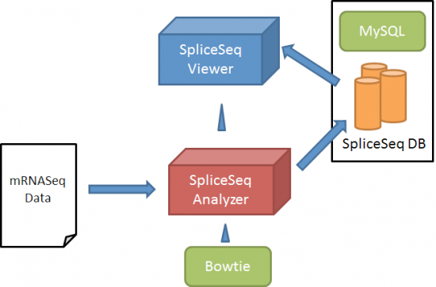
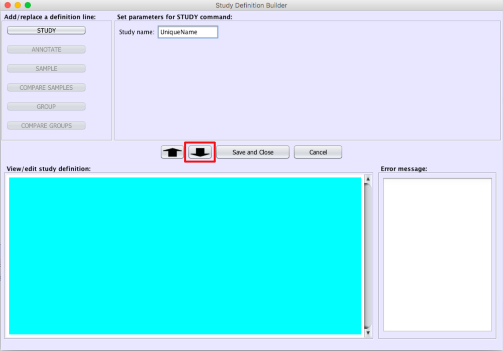

# SpliceSeq_Usage  
## 1. 下载  
### 1.1 SpliceSeq软件包  
[SpliceSeq.zip](http://projects.insilico.us.com/SpliceSeq_2.3/SpliceSeq.zip)  
### 1.2 SpliceSeq数据库  
[SpliceGraphDB.zip](http://projects.insilico.us.com/SpliceSeq_2.1/SpliceGraphDB.zip)  
### 1.3 HeLa测序数据  
R1: [ENCFF000FOM](https://www.encodeproject.org/files/ENCFF000FOM/@@download/ENCFF000FOM.fastq.gz)  
R2: [ENCFF000FOV](https://www.encodeproject.org/files/ENCFF000FOV/@@download/ENCFF000FOV.fastq.gz)  
## 2. 安装及配置  
### 2.1 解压软件包  
### 2.2 命令行运行  
```bash
java -jar SpliceSeq.jar
```
### 2.3 配置SpliceSeq  
` File ` > ` Configuration Panel `  

**DBURL** – This is the DB connect string and contains the URL to get to the database server (for example, jdbc:mysql://localhost for a database on the machine where SpliceSeq Viewer is installed or jdbc:mysql://projects.insilico.us:3306 to connect to another server through a specific port). We run a web service to provide access to our pre-loaded SpliceSeq DB in a way which does not have problems with firewalls. This connections will have a DBURL of jdbc:ratway://projects.insilico.us.com/Ratway/RW.

**SGDatabase** – This is the name of the SpliceSeq DB on the server. Default is SpliceGraph. Note: Windows sometimes forces database names to be in lower cases, so if ‘SpliceGraph’ does not work try ‘splicegraph’.

**DBUser** – MySQL user ID for connecting to the SpliceSeq DB.

**DBPassword** – MySQL password for connecting to the SpliceSeq DB.

我的配置：  
  
### 2.4 配置SpliceSeq DB  
```bash
mysql -u root -p
```
Enter password: ******  
```mysql based
Welcome to the MySQL monitor. Commands end with ; or \g.
Server version: 5.0.51b-community-nt MySQL Community Edition (GPL)
mysql> CREATE DATABASE SpliceGraph CHARACTER SET latin1 COLLATE latin1_general_ci;
Query OK, 1 row affected (0.05 sec)
```
For users that will connect with ‘read only’ permission to analyze the data, create a MySQL users (for example, sguser) with a password (for example, sgpass), and then grant read permission on the new SpliceSeq DB to the newly created user:  
```mysql based
mysql>GRANT SELECT ON SpliceGraph.* TO 'sguser'@'localhost' IDENTIFIED BY 'sgpass';
mysql>GRANT SELECT ON SpliceGraph.* TO 'sguser'@'%' IDENTIFIED BY 'sgpass';
```
You will also need a database user with full permission on the database in order analyze / load RNASeq data. Create another MySQL user (for example, sgload) with a password (for example, sg4ld!), and then grant full permission on the new SpliceSeq DB to the new user.  
```mysql based
mysql>GRANT ALL ON SpliceGraph.* TO 'sgload'@'localhost' IDENTIFIED BY 'sg4ld!';
mysql>GRANT ALL ON SpliceGraph.* TO 'sgload'@'%' IDENTIFIED BY 'sg4ld!';
mysql>exit;
```
Finally, some initial tables and data must be loaded into the blank SpliceSeq DB you have just created. Download, unzip, and load the current SpliceGraphDB on the machine that is hosting your new SpliceSeq DB. Use the MySQL user ID with full database permissions defined above to load the initial data into the database.  
```bash
unzip SpliceGraphDB.zip
mysql -u sgload -p SpliceGraph < SpliceGraphDB.sql
Enter password: ******
```
### 2.5 安装Bowtie
## 3 运行分析
### 3.1 分析流程
  
### 3.2 调节比对参数
` File ` > ` Configuration Panel `  
  
### 3.3 运行比对分析
` Data ` > ` Load Study Data `  
#### 3.3.1 选择新建(New)  
  
#### 3.3.2 设定项目名称  
  
#### 3.3.3 选定ANNOTATION  
[SampleStudy.arff](./SampleStudy.arff)(可能需要调整内容)  
#### 3.3.4 选定样本测序文件  
  
#### 3.3.5 保存  
  
#### 3.3.6 运行  
  
命令会后台运行，可以退出软件  
## 4 结果查看  
完成后显示` Completed `  
  
在主界面，选择` Sample View `，进而选择需要查看的样本。  
  
  